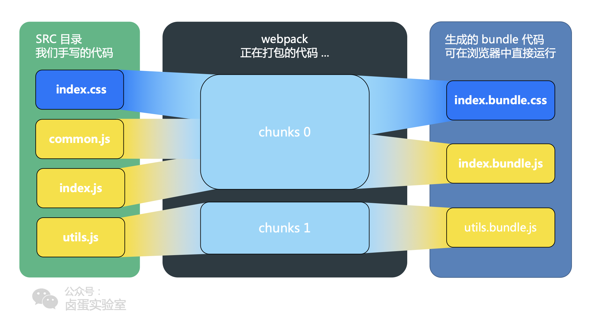

### webpack打包原理
https://segmentfault.com/a/1190000016355127
https://www.jianshu.com/p/e24ed38d89fd

**两个核心原理：**
* 1、一切皆模块
```
将js、css、img、html 都视为一个模块。 ---- 原因是因为都有相应的loader进行转换
都可以用 require('myJSfile.js')，也可以require('myCSSfile.css')。
意味着我们可以将事物（业务）分割成更小的易于管理的片段，从而达到重复利用等的目的。
```
* 2、按需加载
```
分割代码然后生成多个“bundle”文件;
异步加载部分代码以实现按需加载
```
**编译出的代码**
1、webpack中的每个模块有一个唯一的id，是从0开始递增的
2、整个打包后的bundle.js是一个匿名函数自执行。参数则为一个数组。
3、数组的每一项都为个function，function的内容则为每个模块的内容，并按照require的顺序排列
```js
(function(modules){
  // 1、模块缓存对象
  var installedModules = {};
  // 2、webpack实现的require
  function __webpack_require__(moduleId) {
      // 3、判断是否已缓存模块
      if(installedModules[moduleId]) {
          return installedModules[moduleId].exports;
      }
      // 4、缓存模块
      var module = installedModules[moduleId] = {
          i: moduleId,
          l: false,
          exports: {}
      };
      // 5、调用模块函数
      modules[moduleId].call(module.exports, module, module.exports, __webpack_require__);
      // 6、标记模块为已加载
      module.l = true;
      // 7、返回module.exports
      return module.exports;
  }
  // 8、require第一个模块
  return __webpack_require__(__webpack_require__.s = 0);
})([
  function (module, exports, __webpack_require__) {
    /* 模块index.js的代码 */
  },
  function (module, exports, __webpack_require__) {
    /* 模块bar.js的代码 */
  }, 
  ...
])
```
> 我们说的模块在这里是一个函数
```
1、因为浏览器本身不支持模块化，那么webpack就用函数作用域来hack模块化的效果。
2、第一个参数module是当前缓存的模块，包含当前模块的信息和exports；
   第二个参数exports是module.exports的引用，这也符合commonjs的规范；
   第三个__webpack_require__ 则是require的实现。

```

#### bundle 和 chunk 、module 
其实就是同一份逻辑代码在不同转换场景下的取了三个名字，可以参照下边的图片理解：   
* **module**: 就是我们写出来的代码。   
  无论是什么 commonJs 还是 ESModule，他们都是一个 module   
* **chunk**: webpack 处理时是叫 chunk。   
  当 module 源文件在webpack打包时，会根据文件引用关系生成 chunk 文件，webpack对这个chunk文件进行一些操作。   
* **bundle**: 最后生成的直接在浏览器中运行的代码。   
  webpack 处理好chunk后，最终输出bundle文件，这个文件包括了经过加载和编译的最终源文件。  

> 一般一个chunk对应一个bundle，比如上图中的 utils.js -> chunks1 -> utils.bundle.js;
> 但是也有例外，比如上图中的，用 MiniCssExtractPlugin 从 chunk0 中抽离出了 index.bundle.css

#### webpack 打包过程
* 1、读取文件分析模块依赖
* 2、对模块进行解析执行(深度遍历)
* 3、针对不同的模块使用相应的loader
* 4、编译模块，生成抽象语法树AST
* 5、循环遍历AST树，拼接输出js。

---------
#### loader
loader 是文件加载器，能够加载资源文件，并解析js 和 非js文件，并进行一些处理。如 编译、压缩等，让webpack有加载和解析非js文件的能力。     
* 处理一个文件可以使用多个loader，配置顺序与执行顺序是相反的
* 第一个执行的 loader 接收源文件内容为参数，后边的以上一个执行的loader返回值作为参数，最后执行的loader返回此模块的js代码
* 本质上是一个函数，输入参数是一个字符串，输出参数也是一个字符串。
```
是个转换器，将A文件进行编译形成B文件，操作的是文件，
比如a.less转换为a.css，单纯的文件转换过程  
```
#### plugin
plugin 是个扩展器, webpack 生命周期中广播出许多事件，plugin可以监听这些事件，在合适的时机通过webpack提供的api改变输出结果。   
```
丰富了webpack本身，针对 loader结束后，webpack打包的整个过程，
不直接操作文件，而是监听webpack打包过程中的某个节点，执行广泛的任务
```

#### bundle 版本控制

#### webpack 构建流程
* 初始化参数：从配置文件和Shell语句中读取与合并参数，得出最终参数   
* 开始编译： 用上一步得到的参数初始化Compiler对象，加载所有配置的插件，执行对象的run方法开始执行编译； 确定入口：根据配置中的entry找出所有的入口文件    
* 编译模块：从入口文件出发，调用所有配置的Loader对模块进行编译，再找出该模块依赖的模块，再递归本步骤直到所有入口依赖的文件都经过了本步骤的处理；  
* 完成模块编译：在经过第 4 步使用Loader翻译完所有模块后，得到了每个模块被翻译后的最终内容以及它们之间的依赖关系 输出资源：根据入口和模块之间的依赖关系，组装成一个个包含多个模块的 Chunk，再把每个Chunk转换成一个单独的文件加入到输出列表，这步是可以修改输出内容的最后机会    
* 输出完成：在确定好输出内容后，根据配置确定输出的路径和文件名，把文件内容写入到文件系统    
-------------------


### hash

------------


