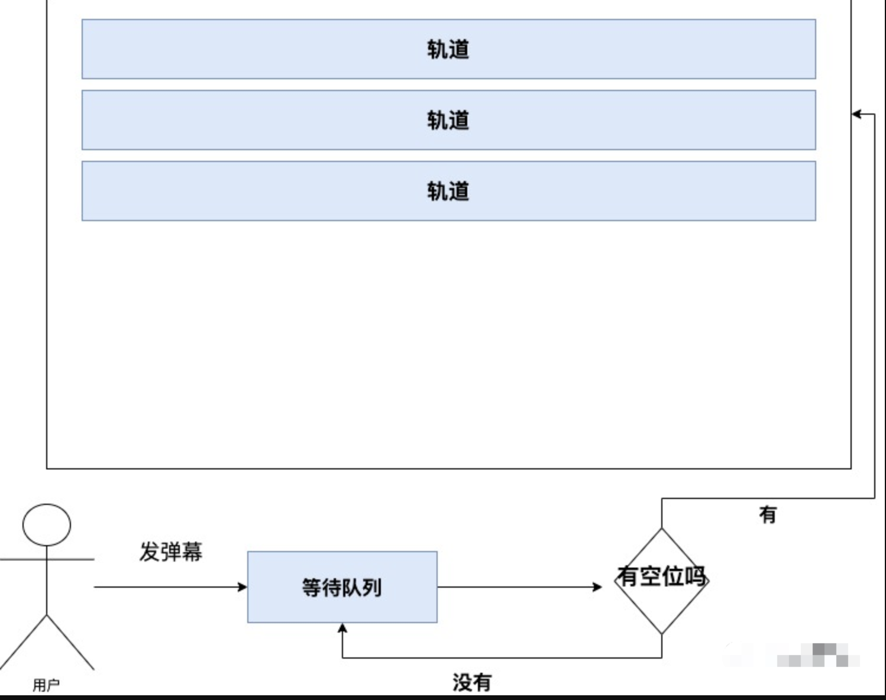

#### 实现方案
<!--  -->

```ts
export default abstract class BaseStage<T extends BarrageObject> extends EventEmitter { 
  protected trackWidth: number 
  protected trackHeight: number 
  protected duration: number 
  protected maxTrack: number 
  protected tracks: Track<T>[] = [] 
  waitingQueue: T[] = []  // 等待队列
 
  // 添加弹幕到等待队列 
  abstract add(barrage: T): boolean 
  // 寻找合适的轨道 
  abstract _findTrack(): number 
  // 从等待队列中抽取弹幕并放入轨道 ：
  // 选择移动前边出屏幕的dom到最后，修改text，复用dom
  abstract _extractBarrage(): void 
  // 渲染函数 
  abstract render(): void 
  // 清空 
  abstract reset(): void 
} 
```
#### 是否有空位的计算
判断最后一个弹幕右边框距离轨道右侧的距离，大于零，则有空位

#### 弹幕不同速度的碰撞问题
为了有更好的效果，会有弹幕速度不同的效果，这个时候就会造成碰撞问题。


方案来源： https://mp.weixin.qq.com/s/VQbJb4g7TX2Yithy1Q1VIA  前端大全 -- 浅谈前端弹幕的设计