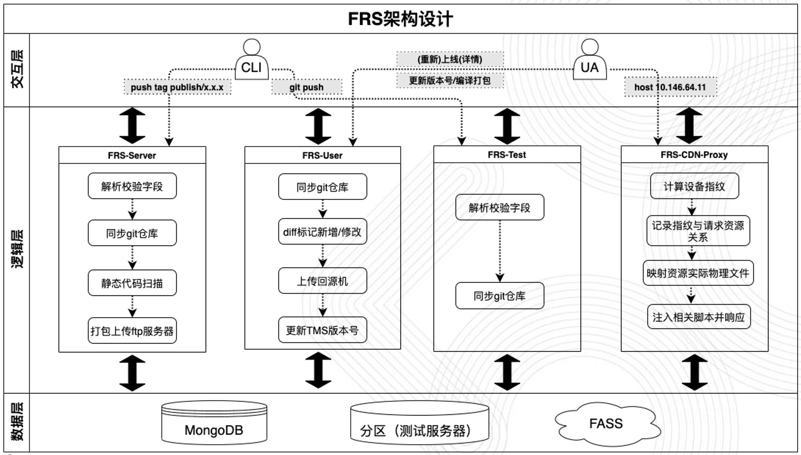

#### 版本控制怎么做的
* **技术实现**
  利用git推送tag操作，触发igit的webhook，回调中间件node的服务，上传ftp，结合网页操作完成上线。

* **访问到最新的资源**
更改资源的url地址为: url + _v + 版本号 + 文件类型
加了版本号的url，请求到回源机时，会过滤 _v+版本号，按实际的文件名去查找

#### node项目用来解决什么问题

#### 内存溢出

#### 并发多少

#### 怎么优化性能

#### Vue 和 react 的区别
* react整体是**函数式的思想**，把组件设计成纯组件，状态和逻辑通过参数传入，所以在react中，是单向数据流；
* vue的思想是**响应式的**，也就是基于是数据可变的，通过对每一个属性建立Watcher来监听，当属性变化的时候，响应式的更新对应的虚拟dom。
* 对象属性 和 状态管理
```
vue 中数据由 data 属性在vue对象中进行管理，
    是双向绑定的，数据变更后会自动触发视图更新
react 中是放到 state 中，直接修改state 属性页面不会更新，
    需要调用 setState 方法更新视图 
```
*  

#### 为什么不用 vue-cli，而是要自己搭建 webpack 环境
```
1、vue-cli不能满足项目需要
2、webpack和插件版本升级啥的更自由一些
3、项目基本都需要引入一些公司内部的插件，都 vue-cli 也得需要更改调整，不如自己搭建的更灵活方便
```
#### rollup 和 webpack 区别，为什么选择rollup 
* webpack
```
优点：
1、可以模块化打包任何资源
2、适配任何模块系统
3、适合 spa 单页应用
缺点：
1、配置比较复杂
2、通过 babel 编译后的 js 代码，打包后体积较大
```
* rollup
```
优点：
1、是基于 ES6 模块设计的，利用 tree-shaking 生成更简洁，更简单的代码
2、用标准化的格式es6来写代码，减少死代码，尽可能的缩小包体积
缺点：
1、对代码拆分、静态资源、commonJs模块支持不好
```


-----------------------------------


